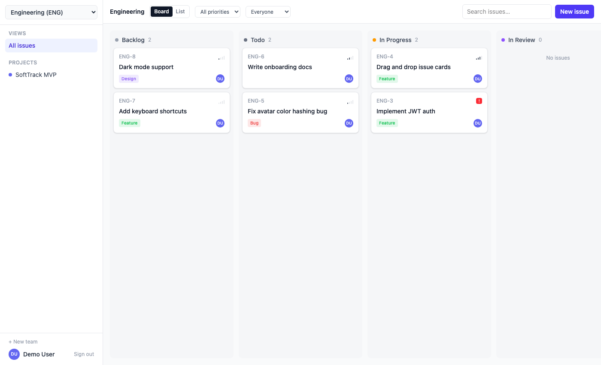

# SoftTrack

An open-source, self-hostable issue tracker inspired by Linear — teams, projects,
a kanban board with drag-and-drop, labels, comments, and filtering. FastAPI backend,
React/Vite/TypeScript frontend with a fully typed API client generated by Orval.



## Features

- Email/password auth (JWT)
- Teams with short keys (e.g. `ENG`) — issues get identifiers like `ENG-42`
- Projects for grouping issues within a team
- Issue status workflow: Backlog → Todo → In Progress → In Review → Done, plus Cancelled
- Priority levels (Urgent/High/Medium/Low/No priority)
- Labels, assignees, comments
- Kanban board with drag-and-drop status changes, plus a filterable list view
- Filter by priority, assignee, and free-text search

Not in this pass (natural follow-ups): cycles/sprints, sub-issues, real-time
multi-user sync, file attachments, email notifications, OAuth/SSO, full-text
search, roadmaps.

## Tech stack

- **Backend**: FastAPI, SQLModel (SQLAlchemy + Pydantic), SQLite by default
  (swap in Postgres via `DATABASE_URL`), JWT auth.
- **Frontend**: React + Vite + TypeScript, Tailwind CSS, React Router,
  TanStack Query, `@dnd-kit` for drag-and-drop, and a typed API client +
  React Query hooks generated from the backend's OpenAPI schema by
  [Orval](https://orval.dev).

## Project structure

```
soft_track/
├── backend/
│   ├── main.py               # FastAPI app, CORS, router registration
│   ├── web.py                # settings, database engine, request session
│   ├── app_identity/         # auth routes (register, login, me)
│   ├── lib_identity/         # auth services + models/ (pydantic schemas)
│   ├── app_softtrack/        # routes: teams, projects, labels, issues, comments
│   ├── lib_softtrack/        # services per domain, tables.py (SQLModel),
│   │                         #   and models/ (pydantic request/response schemas)
│   ├── lib_utils/            # shared helpers: password hashing, JWT tokens
│   ├── seed.py               # populates demo user/team/project/issues
│   ├── export_openapi.py     # writes openapi.json (no server needed)
│   ├── smoke_test.sh         # curl-based end-to-end API test
│   └── requirements.txt
└── frontend/
    ├── orval.config.ts       # codegen config (reads ../backend/openapi.json)
    ├── src/
    │   ├── api/
    │   │   ├── client.ts     # axios instance + JWT interceptor (Orval mutator)
    │   │   └── generated/    # typed client + React Query hooks (generated)
    │   ├── auth/             # AuthContext, RequireAuth route guard
    │   ├── team/             # TeamContext (current team/projects/labels/members)
    │   ├── components/       # Sidebar, TopBar, KanbanBoard, IssueDetailPanel, ...
    │   └── pages/             # Login, Register, NewTeam, Board
    └── package.json
```

## Quickstart

Requires Python 3.11+ and Node 20+.

### 1. Backend

```bash
cd backend
python3 -m venv venv
source venv/bin/activate          # Windows: venv\Scripts\activate
pip install -r requirements.txt
cp .env.example .env               # adjust SECRET_KEY etc. if needed

python seed.py                     # creates a demo user/team/project/issues
uvicorn main:app --reload          # http://localhost:8000
```

Demo login: `demo@softtrack.dev` / `password123`

Run `./smoke_test.sh` (with the server running) to exercise the full API
flow — register, team, project, label, issue, status patch, comment.

### 2. Frontend

In a second terminal:

```bash
cd frontend
npm install
cp .env.example .env.local         # points at http://localhost:8000 by default
npm run dev                        # http://localhost:5173
```

The generated API client under `src/api/generated/` is already checked in
and up to date with the backend as shipped, so `npm run dev` alone is enough
to get started. Sign in with the demo login above, or register a new account
(you'll be prompted to create a team on first login).

### Regenerating the API client

Any time you change backend routes, request/response schemas, or models,
regenerate the frontend client so its types stay in sync:

```bash
cd backend && source venv/bin/activate && python export_openapi.py
cd ../frontend && npm run generate:api
```

(`npm run export:openapi` does the first step for you if your backend venv
is at the default path.)

## Notes

- SQLite is the default database — fine for local use and small teams. Point
  `DATABASE_URL` in `backend/.env` at a Postgres instance for anything more
  serious.
- `SECRET_KEY` in `backend/.env.example` is a placeholder — generate a real
  one (`python -c "import secrets; print(secrets.token_urlsafe(48))"`) before
  running this anywhere beyond your own machine.
- CORS origins for local dev are set in `backend/web.py`
  (`cors_origins`) — add your deployed frontend's origin there for production.

## License

MIT — see [LICENSE](LICENSE).
